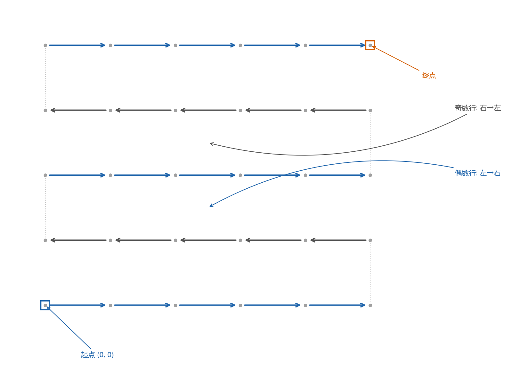
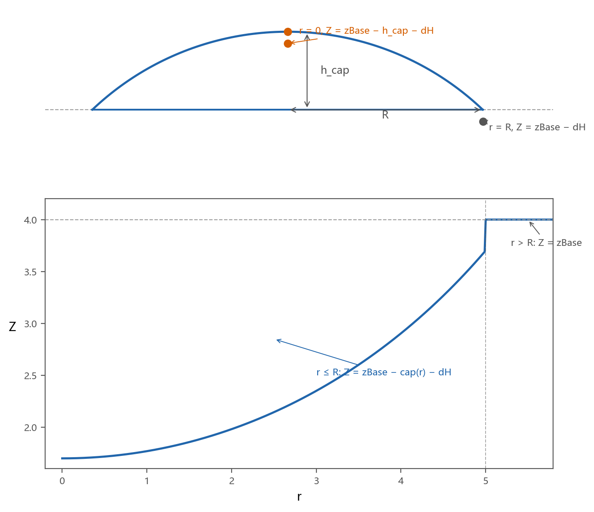
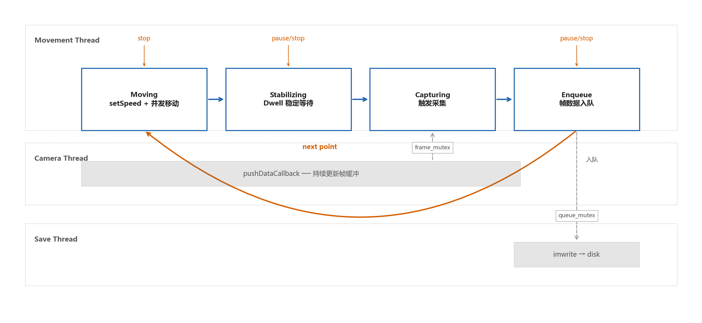

# 扫描算法流程

> ArmSightStitch 明场显微镜自动扫描系统的算法设计方案

自动扫描的核心任务是在显微镜物镜下按预定网格逐点采集样品图像，再将这些局部视场拼接为完整的大幅面样品图。这一任务受制于三个因素：机械臂通信往返延迟达数十毫秒且协议为半双工，所有读写必须串行；样品表面带有球面曲率，需动态补偿 Z 轴以保证对焦；图像采集和磁盘保存相对耗时，不宜与运动控制串行执行。扫描算法针对这些制约设定了五项原则——路径采用 S 形之字形排列以缩短空行程；XY 坐标与 Z 轴补偿在路径生成阶段一并算出，执行阶段只读不算是；图像采集与保存从运动控制流程中解耦；路径上的每一点附带行列元数据，供拼接时定位；通过中断标志实现可随时暂停、恢复和终止的交互能力。

---

## S 形扫描路径

扫描网格由列数、行数、起点 XY 坐标和终点 XY 坐标定义。步长由起止范围和网格数计算得出，X 方向步长为（终点 X 减起点 X）除以（列数减一），Y 方向步长为（终点 Y 减起点 Y）除以（行数减一）。这样路径始终精确覆盖设定的扫描区域，不会因步长与网格数不匹配而产生累积误差。

偶数行从左到右遍历，奇数行从右到左遍历。对于一个 N×M 网格，S 形排列将总行程从逐行单向的约 2NM 步减少到约 NM 加（N 减一）步，省去了每行结束后的长距离回程。路径生成是运动控制的前置步骤，在扫描开始时同步完成，结果是包含所有网格点坐标的序列，后续运动控制只需按序遍历，无需在线计算。

生成路径的同时，每个点附带行列号（row, col）作为逻辑网格位置。由于 S 形排列使物理访问顺序与逻辑位置不再一致，这些元数据必须在生成时锚定，供后续图像命名和拼接定位使用。旋转轴在扫描中不参与运动，所有点的旋转轴角度继承自起始位置的设定值。

---

## 球冠 Z 轴补偿

对于曲面样品，若扫描全程保持 Z 轴不变，远离中心的位置会逐渐失焦。系统采用球冠模型将样品曲面近似为球面的一部分，根据每个扫描点到网格中心的水平距离计算 Z 轴高度。

补偿计算依赖四个参数：R 为球冠在 XY 平面的投影半径，h_cap 为球冠在 Z 方向的高度，zBase 为基准 Z 平面（球冠底面高度），dH 为固定偏移量（用于微调焦面与球面的距离）。首先计算当前点到网格中心的水平距离 r。若 r 超出球冠半径 R，则该点不在球冠范围内，Z 保持 zBase 不变。若 r 在球冠范围内，则由 R 和 h_cap 反推出完整球体半径 Rs——Rs 等于（R² 加 h_cap²）除以（2 乘以 h_cap）——然后计算该点在球面上的高度 cap，cap 等于 √（Rs² 减 r²）减（Rs 减 h_cap）。最终 Z 坐标为 zBase 减 cap 减 dH，钳制在 0 到 zBase 范围内。

网格中心（r 为零）的 Z 值最高，为 zBase 减 h_cap 减 dH；越靠近球冠边缘（r 等于 R）Z 值越低，降至 zBase 减 dH；球冠之外的区域 Z 保持在 zBase 不变。当 h_cap 为零时补偿算法自动旁路，所有点使用相同 Z 高度，不影响平面样品的正常扫描。

---

## 单点处理循环与线程协作

每个网格点的处理是一个四步循环：多轴并发移动并确认到达、稳定等待、触发采集、将帧数据入队通知保存线程。循环过程中在多个关键点检查中断标志，实现可随时暂停和终止。

每点移动涉及 X、Y、Z 三个平动轴。为缩短单点周期，三轴同时写入目标位置并同时触发运动，而非逐轴依次移动。到达确认采用连续多次读取当前位置均在容差范围内视为到达的方式——单次读取会因电磁干扰产生瞬时跳变。若某轴超时未到达，对该轴切换到单轴顺序移动作为补救。由于机械臂控制器同一时刻只能处理一个请求，所有读写必须串行：运动控制在发送命令阶段持有通信通道，在等待到达阶段释放，后台轮询在扫描期间暂停以防止竞争。

相机在运行过程中持续将最新帧缓存到内存缓冲区，运动控制需要采集时直接从缓冲区取用当前最新帧，不阻塞相机数据流。单次采集允许有限次重试以应对曝光尚未完成等偶发失败，多次重试仍失败则记录错误但继续扫描，不因单点故障影响其余点的数据完整性。

运动控制采集完成后将帧数据连同行列元数据推入队列，随即继续处理下一个网格点，不等待写盘完成。一个独立的保存线程从队列取出数据写入磁盘。这种生产者-消费者解耦使扫描节拍由运动时间和采集时间决定，保存延迟完全不进入关键路径，同时保证了在扫描流程返回之前所有已采集的图像均已写入磁盘。

循环体入口、移动完成后、稳定等待期间和采集完成后均检查中断标志。暂停时流程停止处理新点，释放通信通道，进入等待-检查循环，恢复后继续；终止时流程在当前点完成后安全退出，机械臂不会在运动途中被强行停止。

在自动模式下，扫描是完整工作流的一个环节——空闲经过连接机械臂、连接相机、归零、扫描到拼接再回到空闲。归零将各轴移动到基准零点，扫描起点固定为该零点位置，保证每次扫描坐标系一致，图像拼接时无需处理坐标漂移。扫描完成后工作流根据结束状态决定进入拼接或回到空闲。

扫描行为由一组配置参数控制。网格参数包括列数、行数、步长（或起止坐标）和基准 Z 高度。运动参数包括单点稳定等待时间、运动速度和位置到达容差。球冠补偿参数包括投影半径、球冠高度和焦面偏移量。

---

## 相关文档

[机械臂连接协议](机械臂连接协议.md)描述了机械臂通信的寄存器映射与指令编码。[libmodbus-fix-summary](libmodbus-fix-summary.md)记录了 Windows MinGW 下通信库的兼容性修复。[deploy-dll-summary](deploy-dll-summary.md)列出了部署输出 DLL 清单和大小。三幅示意图由 [scan_algorithm_diagrams.py](scan_algorithm_diagrams.py) 生成，输出到 [diagrams/](diagrams/) 目录。
